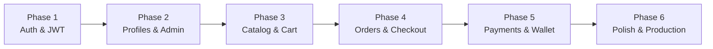

# Sovely E-Commerce Platform — Full Implementation Plan

## Project Audit Summary

### What Exists Today
| Layer | Status | Details |
|-------|--------|---------|
| **Mongoose Models** | ✅ Complete (14) | User, OtpToken, Customer, Category, Product, CustomerPricing, Wishlist, Cart, Order, Invoice, Payment, WalletTransaction, StockAdjustment, Counter |
| **Utilities** | ✅ Ready | [ApiError](file:///d:/JOSEPH%20VISHAL/OneDrive/Documents/MSRIT/Internship%20%28Sovely%29/E-commerce%20Website/src/utils/ApiError.js#1-22), [ApiResponse](file:///d:/JOSEPH%20VISHAL/OneDrive/Documents/MSRIT/Internship%20%28Sovely%29/E-commerce%20Website/src/utils/ApiResponse.js#1-9), [asyncHandler](file:///d:/JOSEPH%20VISHAL/OneDrive/Documents/MSRIT/Internship%20%28Sovely%29/E-commerce%20Website/src/utils/asyncHandler.js#1-6) — clean error handling foundation |
| **Express Setup** | ✅ Running | [app.js](file:///d:/JOSEPH%20VISHAL/OneDrive/Documents/MSRIT/Internship%20%28Sovely%29/E-commerce%20Website/src/app.js) with CORS, JSON, cookie-parser, helmet available. [index.js](file:///d:/JOSEPH%20VISHAL/OneDrive/Documents/MSRIT/Internship%20%28Sovely%29/E-commerce%20Website/src/index.js) with dotenv + nodemon |
| **Database** | ✅ Connected | MongoDB Atlas (`db_sovely`) via Mongoose |
| **Routes** | 🟡 Minimal | Only `/api/v1/health` exists |
| **Controllers** | ❌ Empty | `src/controllers/` is empty |
| **Middlewares** | ❌ Empty | `src/middlewares/` is empty |
| **Frontend** | 🟡 Scaffolded | Vite React app in `web-app/` with luxury dark theme, no routing yet |

### Skills Applied
| Skill | Applied To |
|-------|-----------|
| `nodejs-backend-patterns` | Express architecture, error handling, middleware structure |
| `frontend-design` | Luxury Minimal aesthetic, intentional typography, CSS variables |
| `react-best-practices` | Component structure, performance patterns |
| `api-security-best-practices` | Informs auth middleware, input validation, rate limiting |
| `api-patterns` | REST conventions, response formats, versioning |
| `error-handling-patterns` | Existing `ApiError`/`ApiResponse` classes |

---

## Phase 1: Authentication & Authorization ⬅️ START HERE
> **Why first?** Nothing else works without knowing who the user is.

### Backend
| File | Type | Description |
|------|------|-------------|
| `src/middlewares/auth.middleware.js` | NEW | JWT verification middleware + role-based `authorize('ADMIN')` guard |
| `src/controllers/auth.controller.js` | NEW | `register`, `login`, `verifyOtp`, `refreshToken`, `logout` |
| `src/routes/auth.routes.js` | NEW | Mount at `/api/v1/auth` |
| `src/app.js` | MODIFY | Import and mount auth routes, add global error handler middleware |

### Dependencies to Install
```
bcrypt jsonwebtoken
```

### Key Design Decisions
- JWT stored in httpOnly cookies (not localStorage) — per `api-security-best-practices`
- Access token (15min) + Refresh token (7d) pattern
- OTP flow uses the existing `OtpToken` model with its partial index constraint
- `asyncHandler` wraps all controller functions to catch errors cleanly

---

## Phase 2: Customer Profile & Admin CRUD
> **Why second?** After auth, users need profiles. Admins need to manage the catalog.

### Backend
| File | Type | Description |
|------|------|-------------|
| `src/controllers/customer.controller.js` | NEW | `getProfile`, `updateProfile`, `addAddress`, `removeAddress` |
| `src/routes/customer.routes.js` | NEW | Mount at `/api/v1/customers` (protected) |
| `src/controllers/admin.controller.js` | NEW | `createProduct`, `updateProduct`, `deleteProduct`, `adjustStock`, `createCategory` |
| `src/routes/admin.routes.js` | NEW | Mount at `/api/v1/admin` (admin-only) |

### Key Design Decisions
- Customer auto-creation on registration using `Counter.getNextSequenceValue('customerId')`
- Admin routes gated behind `authorize('ADMIN')` middleware
- Product CRUD validates `categoryId` existence before saving

---

## Phase 3: Catalog & Cart (Core Shopping Flow)
> **Why third?** This is the heart of the e-commerce experience.

### Backend
| File | Type | Description |
|------|------|-------------|
| `src/controllers/product.controller.js` | NEW | `listProducts`, `getProduct`, `searchProducts` (public) |
| `src/routes/product.routes.js` | NEW | Mount at `/api/v1/products` (public) |
| `src/controllers/cart.controller.js` | NEW | `getCart`, `addToCart`, `updateQty`, `removeFromCart`, `clearCart` |
| `src/routes/cart.routes.js` | NEW | Mount at `/api/v1/cart` (protected) |
| `src/controllers/wishlist.controller.js` | NEW | `getWishlist`, `addToWishlist`, `removeFromWishlist` |
| `src/routes/wishlist.routes.js` | NEW | Mount at `/api/v1/wishlist` (protected) |

### Frontend (Start Building Real Pages)
| File | Type | Description |
|------|------|-------------|
| `web-app/src/pages/` | NEW dir | `Home.jsx`, `ProductList.jsx`, `ProductDetail.jsx`, `Cart.jsx` |
| `web-app/src/components/` | NEW dir | `Navbar.jsx`, `ProductCard.jsx`, `Footer.jsx` |
| React Router setup | MODIFY | Install `react-router-dom`, configure routes in `App.jsx` |

### Key Design Decisions
- Product listing supports pagination via `mongoose-aggregate-paginate-v2` (already installed!)
- Cart enforces MOQ (minimum order quantity) from Product model
- Wishlist is a simple toggle — add/remove by `productId`

---

## Phase 4: Order & Checkout Flow
> **Why fourth?** Cart → Order is the conversion moment.

### Backend
| File | Type | Description |
|------|------|-------------|
| `src/controllers/order.controller.js` | NEW | `placeOrder`, `getMyOrders`, `getOrderById`, `cancelOrder` (admin: `updateOrderStatus`) |
| `src/routes/order.routes.js` | NEW | Mount at `/api/v1/orders` (protected) |
| `src/controllers/invoice.controller.js` | NEW | `getInvoice`, `listMyInvoices` |
| `src/routes/invoice.routes.js` | NEW | Mount at `/api/v1/invoices` (protected) |

### Frontend
| File | Type | Description |
|------|------|-------------|
| `web-app/src/pages/Checkout.jsx` | NEW | Order summary, address selection, place order |
| `web-app/src/pages/Orders.jsx` | NEW | Order history with status tracking |

### Key Design Decisions
- Order creation is a **Mongoose transaction**: snapshot cart items → create order → create invoice → clear cart
- Each order generates an `orderId` via `Counter.getNextSequenceValue('orderId')`
- Each invoice generates an `invoiceNumber` via `Counter.getNextSequenceValue('invoiceNumber')`
- Stock is decremented atomically on order placement

---

## Phase 5: Financial Layer (Payments & Wallet)
> **Why fifth?** Once orders exist, we need to settle them.

### Backend
| File | Type | Description |
|------|------|-------------|
| `src/controllers/payment.controller.js` | NEW | `initiatePayment`, `confirmPayment`, `getPaymentStatus` |
| `src/routes/payment.routes.js` | NEW | Mount at `/api/v1/payments` (protected) |
| `src/controllers/wallet.controller.js` | NEW | `getBalance`, `getTransactionHistory` (admin: `creditWallet`) |
| `src/routes/wallet.routes.js` | NEW | Mount at `/api/v1/wallet` (protected) |

### Key Design Decisions
- Payment always targets an Invoice (mandatory `invoiceId`)
- `referenceId` ensures idempotency (no double charges)
- Wallet credits go through the Dual-Path Enforcer (`pre('validate')` hook)
- Admin wallet top-ups create a `WALLET_TOPUP` invoice

---

## Phase 6: Polish & Production Readiness
> **Why last?** Optimize what already works.

### Backend
| Task | Description |
|------|-------------|
| Input validation | Add `express-validator` or `zod` schemas to all routes |
| Rate limiting | `express-rate-limit` on auth endpoints (per `api-security-best-practices` skill) |
| Helmet | Already installed — enable in `app.js` |
| Global error handler | Centralized middleware that catches `ApiError` instances |
| Logging | Add `morgan` or `pino` for request logging |
| `.env` cleanup | Add `JWT_SECRET`, `JWT_EXPIRY`, `REFRESH_TOKEN_SECRET` |

### Frontend
| Task | Description |
|------|-------------|
| Auth context | React Context for login state, token management |
| Protected routes | Redirect unauthenticated users to login |
| Loading states | Skeleton loaders per `react-ui-patterns` skill |
| Error boundaries | Catch rendering errors gracefully |
| Responsive design | Mobile-first breakpoints |

---

## Execution Order Diagram



## Verification Plan

Each phase will be verified before moving to the next:
- **Backend**: Test each endpoint via browser or curl
- **Frontend**: Visual verification in the browser
- **Integration**: Frontend successfully calls backend APIs
